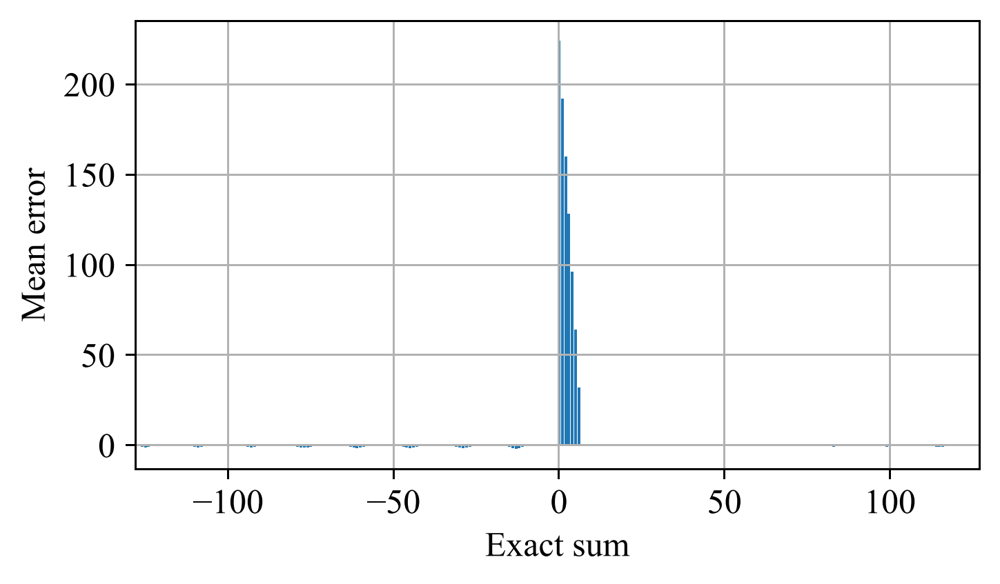
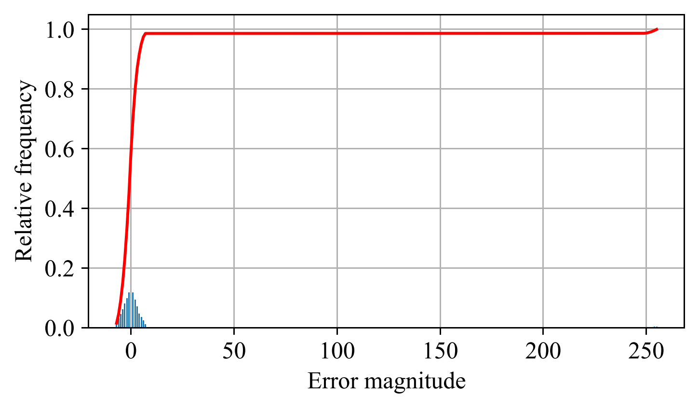
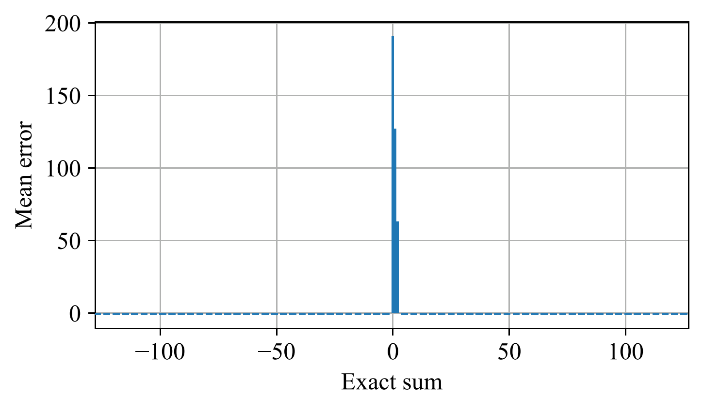

# `emixa`: Error Modeling of IneXact Arithmetic

This repository contains a library for nearly automatic characterization of approximate arithmetic units. These units are imported from the [approx](https://github.com/aproposorg/approx) and written in [Chisel](https://github.com/chipsalliance/chisel3), with tests described in [ChiselTest](https://github.com/ucb-bar/chiseltest). In its current form, `emixa` only supports characterizing adders and multipliers, producing plots of their error characteristicts and/or (approximated) Python descriptions of their functionality.

The tool is invoked with the command line as follows:

```shell
python3 emixa.py [-f[unction]] [-p[lots]] [-v[erbose]] CHARACTERIZER_NAME [ARG ...]
```

The `-f` and `-p` flags enable outputting Python functions and plots, respectively. The `-v` flag puts the tool in verbose mode under which it forwards stdout outputs from the ChiselTest characterizers to the tool's stdout. `CHARACTERIZER_NAME` denotes the name of a characterizer class defined by the user, which is passed arguments `ARG ...`. The tool supports range-style arguments `start:stop[:by]` to execute tests for, say, multiple bit-widths in one call, for example:

```shell
python3 emixa.py -p -v ApproxAdderSpec 32 8:16:2
```

When you use this library in a research project, please cite it as:

```
@misc{damsgaard2024emixa,
  title={{emixa: Error Modeling of IneXact Arithmetic}},
  author={Damsgaard, Hans Jakob},
  year={2024},
  howpublished={\url{https://github.com/aproposorg/emixa}}}
```

This README only contains a brief overview of the library's current functionality. For more details on the included arithmetic units, please refer to its standalone documentation. Refer to the [Digital Design with Chisel](https://github.com/schoeberl/chisel-book/) book for more details on using Chisel for hardware design.

***
# Requirements

Apart from its core components described written in Python, the library requires a suitable installation of Scala for the `approx`, Chisel, and ChiselTest components to compile and execute. For this purpose, we use the Scala Build Tool (`sbt`) for which we provide a suitable build script. To install the needed Python packages, execute the following command:

```shell
pip3 install -r ./requirements.txt
```

`emixa` does not require Verilator to be installed for pure Chisel designs, but if it is available, the tool will automatically use it to speed up simulations. Blackbox designs require an installation of Verilator. Note that only [specific versions of Verilator](https://github.com/ucb-bar/chiseltest#verilator-versions) are officially supported.

This library is tested in Ubuntu 20.04 with Python 3.8 and Verilator 4.028.

***
# Using the library

Using `emixa` involves the definition of a _characterizer_; a test class that extends one of the two base characterizer classes `emixa.AdderCharacterizer` or `emixa.MultiplierCharacterizer`. The characterizer must define two values: `sgn`, denoting the signedness of the targeted arithmetic unit, and `chartype`, denoting the type of characterization to perform. Moreover, the characterizer must call the `characterize` method inherited from the aforementioned classes within its body. In the current state, the library supports three characterization styles: (1) exhaustive (for designs whose operands are 8 bits or smaller), and (2) random 2D, and (3) random 3D (both for designs whose operands are 64 bits or smaller). The different characterization styles affect which plots and/or Python functions the tool produces. As an example, consider the following signed random 2D characterizer of an imaginary approximate adder `ApproxAdder`:

```scala
import emixa.AdderCharacterizer
import emixa.Signedness.Signed
import emixa.Characterization.Random2D

class ApproxAdderSpec extends AdderCharacterizer {
  val sgn = Signed
  val chartype = Random2D

  characterize[ApproxAdder]()
}
```

`emixa`'s infrastructure automatically handles passing arguments of the right types to instantiate the approximate arithmetic unit within the characterizer through runtime reflection. Arguments which cannot be cast to the right type give rise to runtime exceptions. Additional arguments beyond the ones needed by the basic constructor of the arithmetic unit are discarded without warnings.

Note that due to limitations in the current way of instantiating and interacting with arithmetic units internal to `emixa`, adders and multipliers must extend their related abstract base classes `approx.addition.Adder` and `approx.multiplication.Multiplier`. For the few designs included in `approx` that do not conform with this requirement, one needs to define a wrapper class.

## Pure Chisel examples

The [examples directory](./src/test/scala/emixa/examples/) includes three simple example characterizers for the [OFLOCA](./approx/src/main/scala/approx/addition/OFLOCA.scala) and [HOAANED](./approx/src/main/scala/approx/addition/HOAANED.scala) adders, and the [ETM](./approx/src/main/scala/approx/multiplication/ETM.scala) multiplier. The OFLOCA characterizer produces the following plots when invoked:

```shell
python3 emixa.py -p OFLOCASpec 8 4 2
```

Mean error vs exact sums      | Relative and cumulative error frequencies
:----------------------------:|:-----------------------------------------:
 | 

## Blackbox example

In addition to the above examples, the [examples directory](./src/test/scala/emixa/examples/) includes a simple example characterizer of a blackbox [LOA](./approx/src/main/scala/approx/addition/LOA.scala) adder. This characterizer produces the following plot when invoked:

```shell
python3 emixa.py -p LOASpec 8 2
```

Mean error vs exact sums   |
:-------------------------:|
 |
